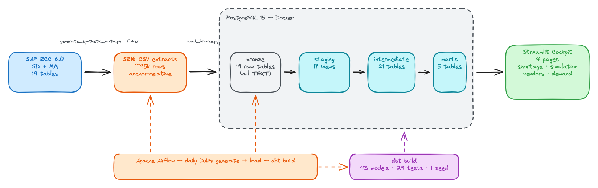
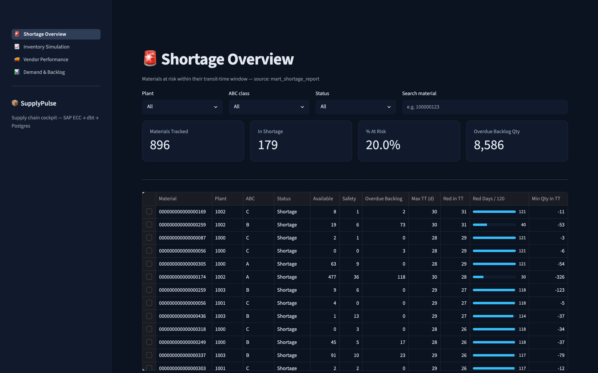
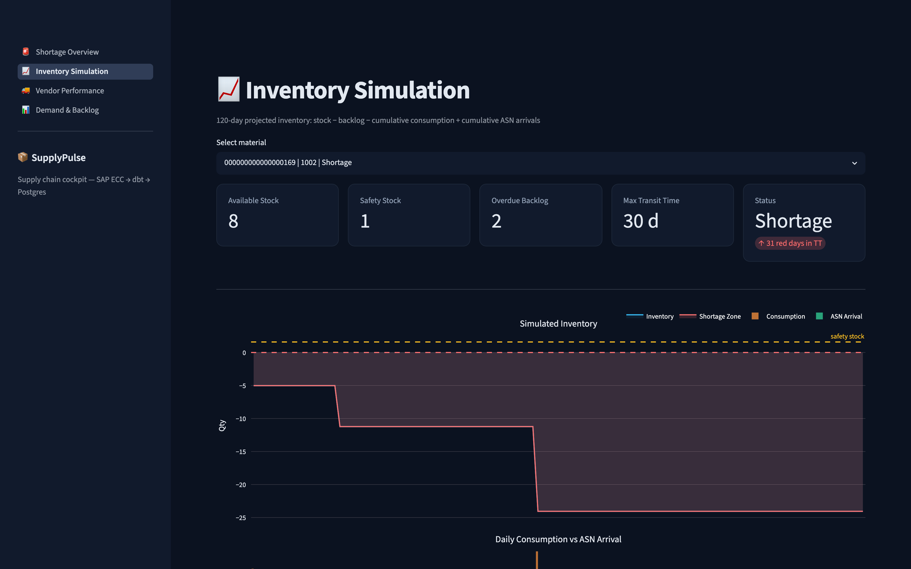
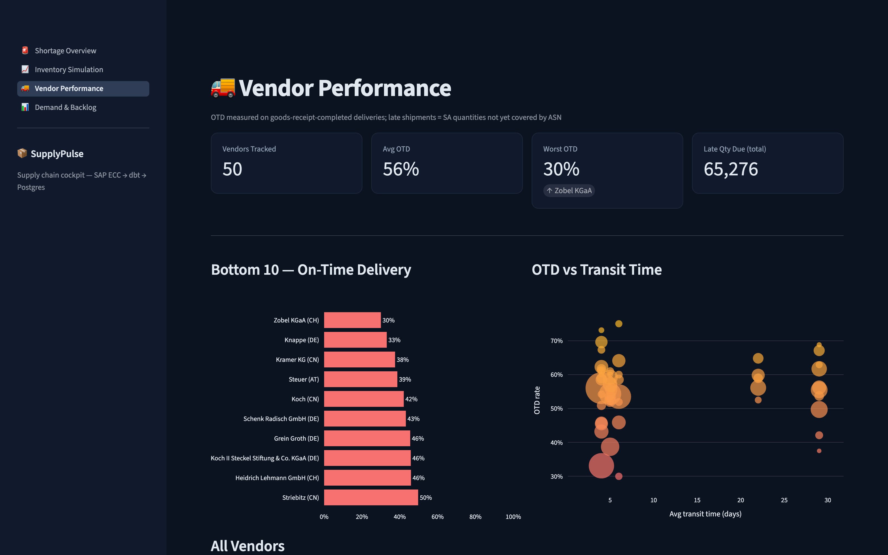
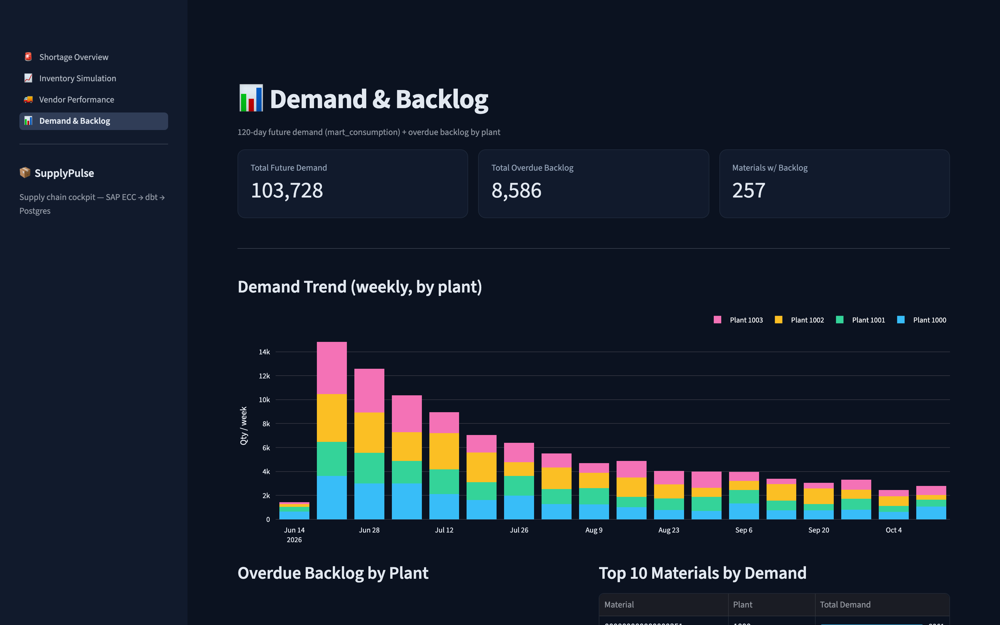

# SupplyPulse 📦

[](https://github.com/BuiDucPhat12/supplypulse/actions/workflows/ci.yml)


**A supply-chain shortage cockpit built on a realistic SAP ECC data model** — synthetic SE16
extracts flow through a Postgres warehouse, are transformed by a 43-model dbt project
encoding real material-planning logic (transit-time windows, working-day calendars, ASN
coverage, quota arrangements), and surface in a Streamlit cockpit that answers one question:
**which materials will run out before a new order could possibly arrive?**

Built from scratch as a portfolio project by a data analyst working in automotive supply
chain — the business logic mirrors how material planners actually monitor shortages,
not a textbook star schema.



## The cockpit

| Shortage Overview | Inventory Simulation |
|---|---|
|  |  |
| 896 material/plant combos, filterable by plant, ABC class and status | 120-day daily projection: stock − backlog − cumulative demand + cumulative ASN arrivals |

| Vendor Performance | Demand & Backlog |
|---|---|
|  |  |
| On-time-delivery rate per vendor, OTD × transit-time scatter | Weekly demand by plant, overdue backlog, top consumers |

## What makes the modeling interesting

The marts are not simple aggregations — they encode planner logic end to end:

- **Inventory simulation** projects stock for every material/plant over the next 120
  calendar days: `available_stock − overdue_backlog − Σ consumption + Σ ASN arrivals`,
  as a window function over a generated daily calendar (`mart_inventory_simulation`,
  ~108k rows).
- **Shortage ≠ negative stock.** A material is only flagged `Shortage` when it goes red
  *inside its transit-time window* — i.e. before a newly placed order could physically
  arrive. Red days after that horizon are actionable, so they don't alarm
  (`mart_shortage_report`).
- **Transit times are working-day aware.** Goods-receipt dates jump over weekends via a
  generated factory calendar (`int_factory_calendar` → `int_working_calendar`), the same
  trick production planning systems use.
- **Supply is reconstructed from two sources**: scheduling-agreement lines not yet
  covered by an ASN (late-shipment detection via cumulative quantity matching) plus
  inbound deliveries already announced (`int_sa_late_shipment`, `int_inbound_deliveries_asn`).
- **Vendor OTD** is measured only on goods-receipt-completed delivery lines, with late
  quantities attributed through the SAP document flow `LIPS → EKKO → LFA1`
  (`mart_vendor_performance`).

## Realistic synthetic data

No production data leaves Bosch — the source is a ~95k-row synthetic generator
([`scripts/generate_synthetic_data.py`](scripts/generate_synthetic_data.py)) that
reproduces 19 SAP ECC 6.0 tables (SD + MM: `VBAK/VBAP`, `EKKO/EKPO/EKET`, `LIKP/LIPS`,
`MARC/MARD`, `EQUK/EQUP`, `RESB`, `VBBE`, `LFA1`, …) with schemas cross-checked against
real ECC field definitions, and distributions that make the dashboards tell a story:

- **anchor-relative dates** — regenerate any day and "today" still sits inside the data
- **ABC/Zipf/lognormal demand** — Pareto holds (~86% of volume from A-materials)
- **vendor personas** — three deliberately bad vendors whose OTD visibly collapses
- **causally consistent statuses** — goods-movement status follows actual dates
- **controlled shortage injection** — ~8% of materials are engineered to go red

74 pytest tests guard FK integrity and the realism properties themselves.

## Pipeline

```
generate_synthetic_data.py  →  load_bronze.py  →  dbt build  →  Streamlit
        (Faker, 19 CSVs)      (idempotent, all-TEXT bronze)   (73 resources)
```

- **dbt**: 17 staging views → 21 intermediate tables → 5 marts, 1 seed,
  **29 data tests** (`dbt build` = 73/73 PASS). Lineage documented in
  [`docs/DATA_LINEAGE.md`](docs/DATA_LINEAGE.md).
- **Airflow** runs the whole chain daily (`dags/daily_pipeline.py`).
- **CI** (GitHub Actions) lints, runs pytest, then executes the full pipeline —
  generate → load → `dbt build` — against a Postgres service container on every push.

## Quickstart

Prereqs: Docker, [uv](https://docs.astral.sh/uv/).

```bash
git clone https://github.com/BuiDucPhat12/supplypulse.git && cd supplypulse
cp .env.example .env
uv sync
make demo        # postgres up → schema → generate data → load → dbt build → cockpit
```

Or step by step:

```bash
make up          # start Postgres (Docker)
make schema      # create bronze tables
make data        # generate synthetic SE16 extracts (~95k rows)
make load        # load CSVs into bronze
make dbt         # dbt deps + dbt build (73 resources)
make app         # launch the Streamlit cockpit on :8501
make test        # ruff + black + pytest
```

The optional Airflow stack (`docker compose up -d`) schedules the same pipeline daily at
06:00 — see [`docs/airflow_guide.md`](docs/airflow_guide.md).

## Project structure

```
├── app/                  # Streamlit cockpit (4 pages + shared design system)
├── dags/                 # Airflow DAG: generate → load → dbt build
├── scripts/              # synthetic data generator, bronze loader, seed generator
├── sql/bronze/           # bronze DDL (all TEXT, idempotent)
├── supplypulse_dbt/      # dbt project: staging → intermediate → marts (+29 tests)
├── tests/                # 74 pytest tests for the data generator
└── docs/                 # data lineage, production logic, SAP source design, notes
```

## Stack & why

| Tool | Why |
|---|---|
| **Postgres 15** | one warehouse for bronze→marts; maps to Azure SQL/Synapse |
| **dbt** | versioned, tested SQL transformations; lineage for free |
| **Airflow** | the de-facto batch orchestrator; LocalExecutor keeps it lightweight |
| **Streamlit + Plotly** | fastest path from mart to interactive cockpit |
| **uv / ruff / black / pre-commit** | modern Python toolchain, enforced in CI |
| **Faker + pandas** | compliance-safe synthetic data with controlled distributions |

## Roadmap

- [ ] Demand forecasting on `mart_consumption` (Prophet baseline → LightGBM + MLflow)
- [ ] Streaming layer: Debezium CDC → Kafka → Spark Structured Streaming
- [ ] FastAPI serving layer + public demo deployment

## Docs worth reading

- [`docs/DATA_LINEAGE.md`](docs/DATA_LINEAGE.md) — every model explained, bronze → mart
- [`docs/PRODUCTION_LOGIC.md`](docs/PRODUCTION_LOGIC.md) — the planner logic the marts encode
- [`docs/sap_source_design.md`](docs/sap_source_design.md) — 19-table SAP source design + field dictionary
- [`docs/notes/`](docs/notes/) — learning notes written while building each layer

## License

MIT
